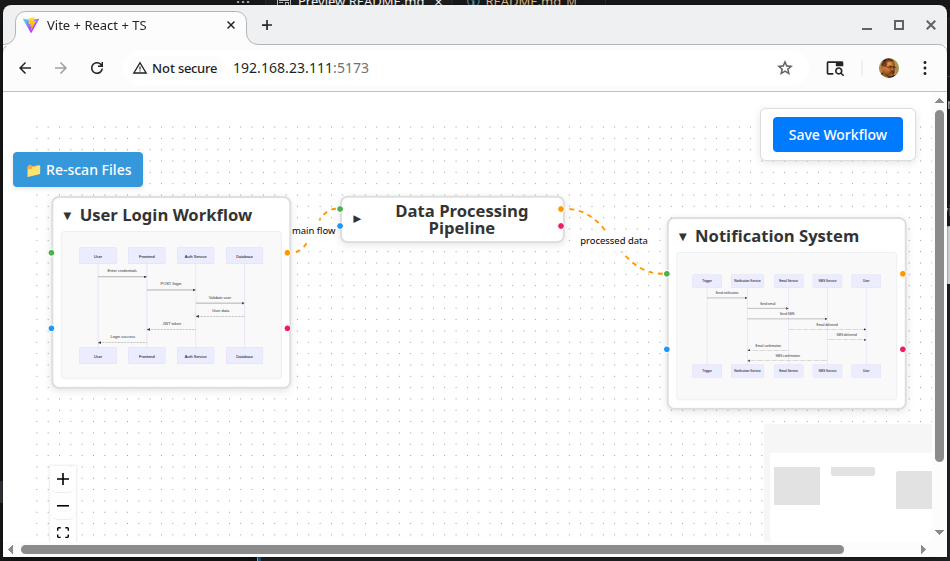

# Siren - Multi-File Markdown Graph

Siren allows you to organize and visualize complex workflows by connecting markdown documents in an interactive graph interface. Each node represents a markdown file containing process documentation, and edges represent relationships between different workflow steps.



### Key Benefits

- **Document Network Visualization**: Transform scattered markdown files into a coherent visual network
- **Process Flow Mapping**: Clearly see how different workflows relate to and depend on each other
- **Interactive Documentation**: Navigate between related processes through visual connections
- **Mermaid Sequence Diagrams**: Embed detailed sequence diagrams within each workflow node
- **Dynamic Content Discovery**: Automatically discovers new markdown files and creates nodes
- **Collaborative Understanding**: Share complex system architectures through visual relationships

## Features

- **Interactive Node Graph**: Drag, resize, and connect workflow nodes on a React Flow canvas
- **Markdown + Mermaid Integration**: Rich content rendering with embedded sequence diagrams
- **Automatic File Discovery**: Scans for markdown files and creates nodes automatically
- **Multiple Connection Types**: Four colored connection handles per node for different relationship types
- **Edge Management**: Create, delete, and label connections with visual feedback
- **Collapse/Expand Nodes**: Minimize visual clutter while preserving relationships
- **Persistent State**: Saves workflow configuration and restores on reload
- **Real-time Updates**: Live mermaid diagram rendering and dynamic resizing

## Installation

### Clone and Setup

```bash
# Clone the repository
git clone <repository-url>
cd siren

# Install dependencies
npm install
```

### Running the Application

#### Option 1: Standard Development (Recommended)
```bash
# Run React app only
npm run dev
```
Access the application at `http://localhost:5173` (or the port shown in terminal)

#### Option 2: Development with Logging
```bash
# Run both React app and logging server
npm run dev-with-logging
```

#### Option 3: Separate Server Management
```bash
# Terminal 1: Start logging server
npm run logging-server

# Terminal 2: Start React app
npm run dev
```

## Logging Server

The logging server runs on port 3001 and provides enhanced debugging capabilities:

### Features
- **Structured Logging**: Captures application events with timestamps and context
- **Console Interception**: Captures all console output from client browsers
- **Network Accessibility**: Works with browsers on different machines
- **File-based Storage**: Writes logs to dated files in the `logs/` directory
- **User Action Tracking**: Detailed logging of resize, move, connect, and delete operations

### Configuration
Modify log levels in `src/utils/logger.ts`:
```typescript
// Change log level: 'debug' | 'info' | 'warn' | 'error'
const LOG_LEVEL: LogLevel = 'warn'; // Default: 'warn'
```

### ⚠️ Security Warning

**The logging server should ONLY be used in development environments.**

**Security Implications:**
- Captures and stores all console output, potentially including sensitive data
- Accepts connections from any network client when running with `host: true`
- Writes logs to local filesystem without authentication
- May expose internal application state and user interactions

**Recommended Security Practices:**
- Never run the logging server in production
- Use firewall rules to restrict access to development networks only
- Regularly clean log files: `rm -f logs/*.log`
- Avoid logging sensitive information in development

## Project Structure

```
siren/
├── src/
│   ├── components/
│   │   ├── WorkflowNode.tsx       # Main node component
│   │   ├── SaveButton.tsx         # State persistence
│   │   └── EdgeContextMenu.tsx    # Edge management
│   ├── utils/
│   │   ├── stateManager.ts        # Workflow state management
│   │   ├── logger.ts              # Logging utilities
│   │   └── consoleInterceptor.ts  # Console capture
│   └── App.tsx                    # Main application
├── public/
│   └── workflows/
│       ├── nodes-and-edges.json   # Workflow configuration
│       └── *.md                   # Markdown workflow files
├── logging-server.js              # Express logging server
└── README.md
```

## Usage

### Adding Workflow Documents

1. Place markdown files in `public/workflows/`
2. Refresh the application to auto-discover new files
3. New nodes will be created automatically in a grid layout
4. Connect related workflows using the colored connection handles

### Creating Connections

- **Green handles**: Primary input connections
- **Blue handles**: Alternative input connections  
- **Orange handles**: Primary output connections
- **Pink handles**: Alternative output connections

### Managing Workflows

- **Collapse/Expand**: Click node titles to minimize/maximize content
- **Resize Nodes**: Drag corner handles to resize individual nodes
- **Edit Connections**: Right-click edges to edit labels or delete
- **Save State**: Use the save button to persist your workflow configuration

## Development

### Building
```bash
npm run build
```

### Testing
Check available test commands:
```bash
# Look for available scripts
npm run lint      # If available
npm run typecheck # If available
npm test         # If available
```

### Log Management
After code changes that trigger reloads:
```bash
rm -f logs/*.log  # Clear logs for clean debugging
```

## License

MIT License - see [LICENSE.md](LICENSE.md) for details.

## Contributing

Make issues.  Submit PRs.  No guarantees, but I will read them.