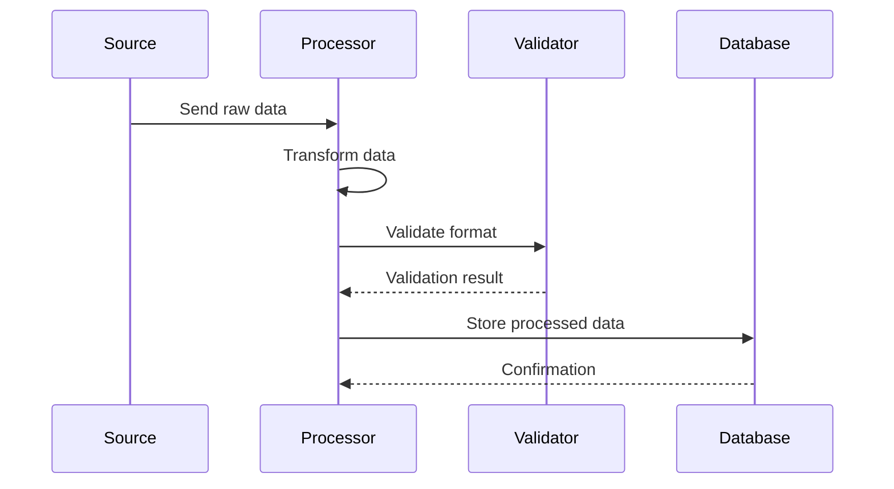

# Data Processing Pipeline

```mermaid
sequenceDiagram
    participant S as Source
    participant P as Processor
    participant V as Validator
    participant DB as Database
    
    S->>P: Send raw data
    P->>P: Transform data
    P->>V: Validate format
    V-->>P: Validation result
    P->>DB: Store processed data
    DB-->>P: Confirmation
```