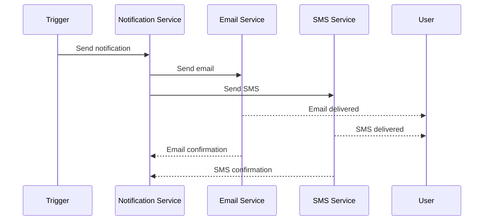

# Notification System

This workflow handles sending notifications to users across multiple channels.

**Input:** Notification request with user ID and message  
**Output:** Delivery confirmation

```mermaid
sequenceDiagram
    participant T as Trigger
    participant N as Notification Service
    participant E as Email Service
    participant S as SMS Service
    participant U as User
    
    T->>N: Send notification
    N->>E: Send email
    N->>S: Send SMS
    E-->>U: Email delivered
    S-->>U: SMS delivered
    E-->>N: Email confirmation
    S-->>N: SMS confirmation
```