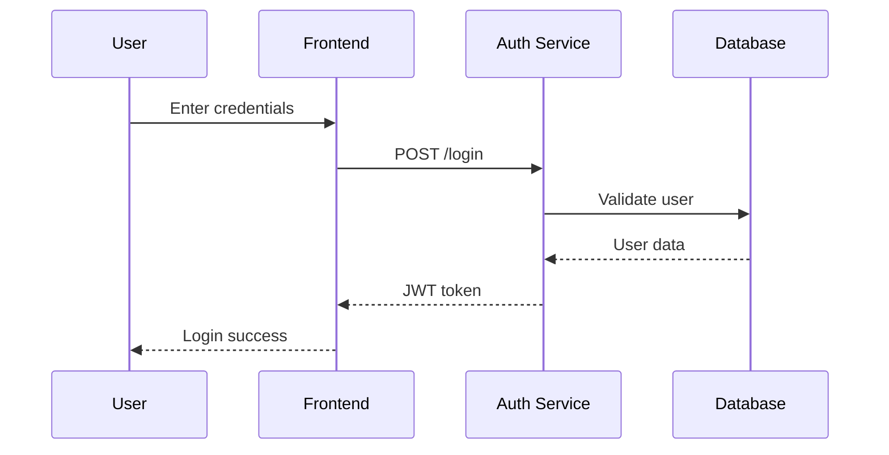

# User Login Workflow

This workflow handles user authentication and login process.

**Input:** Username and password  
**Output:** Authentication token

```mermaid
sequenceDiagram
    participant U as User
    participant F as Frontend
    participant A as Auth Service
    participant D as Database
    
    U->>F: Enter credentials
    F->>A: POST /login
    A->>D: Validate user
    D-->>A: User data
    A-->>F: JWT token
    F-->>U: Login success
```